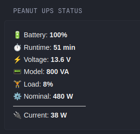

# PEANUT UPS STATS
- The widget returns statistics on from PeaNut to Monitor UPS 



```yaml
      - type: custom-api
        title: PeaNUT UPS Status
        url: http://${PEANUT_URL}/api/v1/devices/${PEANUT_DEVICE}
        method: GET
        cache: 1m
        headers:
          Accept: application/json
          Authorization: "Basic ${PEANUT_AUTH}"
        template: |
            {{ $j := .JSON }}
            {{ $batteryCharge   := $j.Int  "battery\\.charge" }}
            {{ $batteryRuntime  := $j.Int  "battery\\.runtime" }}
            {{ $batteryVoltage  := $j.Float "battery\\.voltage" }}
            {{ $deviceModel     := $j.Int  "device\\.model" }}
            {{ $upsLoad         := $j.Int  "ups\\.load" }}
            {{ $upsNominalPower  := $j.Int  "ups\\.realpower\\.nominal" }}
            {{ $currentLoad := div (mul $upsLoad $upsNominalPower) 100 }}
            <div style="font-family:Arial,sans-serif;color:#f5f5f5;line-height:1.5;max-width:300px;">
              <p style="margin:4px 0;font-size:1.1em;">🔋 Battery: <strong>{{ printf "%d%%" $batteryCharge}}</strong></p>
              <p style="margin:4px 0;font-size:1.1em;">⏱️ Runtime: <strong>{{ printf "%d min" (div $batteryRuntime 60) }}</strong></p>
              <p style="margin:4px 0;font-size:1.1em;">⚡ Voltage: <strong>{{ printf "%.1f V" $batteryVoltage }}</strong></p>
              <p style="margin:4px 0;font-size:1.1em;">📟 Model: <strong>{{ printf "%d VA" $deviceModel }}</strong></p>
              <p style="margin:4px 0;font-size:1.1em;">🏋️ Load: <strong>{{ printf "%d%%" $upsLoad  }}</strong></p>
              <p style="margin:4px 0;font-size:1.1em;">⚙️ Nominal: <strong>{{ printf "%d W" $upsNominalPower }}</strong></p>
              <hr style="border:none;border-top:1px solid #ddd;margin:8px 0;max-width:150px">
              <p style="margin:4px 0;font-size:1.1em;">🔌 Current: <strong>{{ printf "%d W" $currentLoad }}</strong></p>
            </div>
```
## Environment variables
- `PEANUT_DEVICE` - Device name
- `PEANUT_URL` - PeaNut URL
- `PEANUT_AUTH` - Bearer Token (For API calls, you'll need to include an Authorization header with the Base64 encoded credentials in the format username:password. The header should be formatted as: Authorization: Basic <encoded credentials> )
